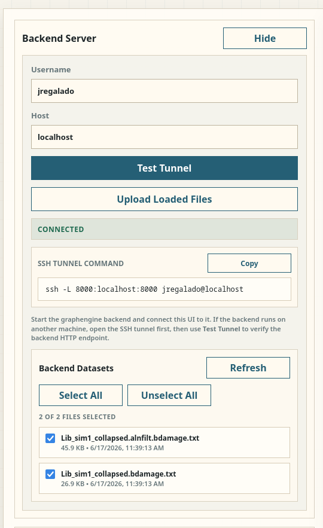
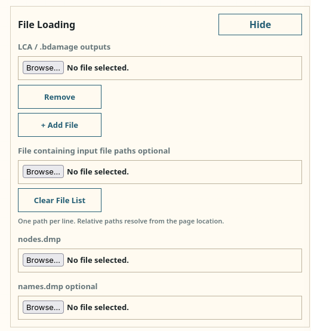

# Unicorn Graphengine

Graphengine is now a backend-authoritative browser UI.

The intended operating model is:

- run the backend server
- open the UI in a browser
- connect the UI to the backend
- upload/select datasets on the backend
- render and explore the backend-served tree

If you are working on one machine, "local" just means the backend runs on
`localhost`. It is still the same backend mode.


## Quick Start

This is the fastest way to get a working local graphengine session.

### 1. Clone the repository

```bash
git clone https://github.com/GeoGenetics/unicorn.git
cd unicorn
```

### 2. Create a Python environment

```bash
python3 -m venv .venv
```

### 3. Activate the environment

```bash
source .venv/bin/activate
```

### 4. Install backend requirements

```bash
pip install -r src/libunicorn/graphengine/server_requirements.txt
```

### 5. Start the backend server

From the repository root:

```bash
cd src/libunicorn/graphengine
uvicorn server_app:app --host 127.0.0.1 --port 8000
```

The backend will create and use the local `uploads/` directory by default.

### 6. Open the UI

Open:

- [index.html](/home/jregalado/Projects/GeoGenetics/unicorn/src/libunicorn/graphengine/index.html)

You can open it directly in a browser.

### 7. Connect the UI to the backend

In the UI:

- set backend user/host fields
- if running locally, use:
  - user: your local computer username
  - host: `localhost`
- click `Test Tunnel`



- upload or select datasets once the backend connection is live
- once `nodes.dmp` and `names.dmp` are available to the backend and selected in
  the UI, click `Render Tree`



Once connected:

- the backend dataset panel becomes available
- backend datasets can be refreshed and selected
- rendering uses backend-served tree data


## What The Backend Does

The backend is the source of truth for:

- uploaded `.bdamage.txt` datasets
- taxonomy files such as `nodes.dmp` and `names.dmp`
- tree construction
- visible tree slicing
- node tooltip payloads
- count matrix and rank report payloads
- compute-backed barplot and PCoA payloads

The browser is responsible for:

- UI controls
- layout
- popup rendering
- transient selection/expansion state


## Start The Backend

### Local backend

Run on the same machine as the browser:

```bash
cd /path/to/unicorn/src/libunicorn/graphengine
source /path/to/unicorn/.venv/bin/activate
uvicorn server_app:app --host 127.0.0.1 --port 8000
```

### Local backend with explicit upload and taxonomy defaults

```bash
cd /path/to/unicorn/src/libunicorn/graphengine
source /path/to/unicorn/.venv/bin/activate
UNICORN_GRAPHENGINE_UPLOAD_DIR=/data/unicorn_graphengine/uploads \
UNICORN_GRAPHENGINE_NODES_FILE=nodes.dmp \
UNICORN_GRAPHENGINE_NAMES_FILE=names.dmp \
uvicorn server_app:app --host 127.0.0.1 --port 8000
```

### True remote backend

Run the server on the remote machine:

```bash
cd /path/to/unicorn/src/libunicorn/graphengine
source /path/to/unicorn/.venv/bin/activate
uvicorn server_app:app --host 127.0.0.1 --port 8000
```

Then, from the machine where the browser is running, open the SSH tunnel:

```bash
ssh -L 8000:localhost:8000 youruser@your-remote-host
```

In the UI:

- host: your remote hostname
- user: your remote username
- click `Test Tunnel`

The browser still talks to `http://localhost:8000`, but the tunnel forwards
that traffic to the remote backend.


## Open The UI

Graphengine is currently a static HTML frontend.

Open:

- [index.html](/home/jregalado/Projects/GeoGenetics/unicorn/src/libunicorn/graphengine/index.html)

If your browser is happier with a local static server, this also works:

```bash
cd /path/to/unicorn/src/libunicorn/graphengine
python3 -m http.server 8080
```

Then open:

- `http://127.0.0.1:8080/index.html`

The backend remains on port `8000`.


## Taxonomy Files

Graphengine expects taxonomy files to be readable by the backend.

Typical files:

- `nodes.dmp`
- `names.dmp`

You can provide them by:

- placing them in the backend upload directory
- setting backend defaults through:
  - `UNICORN_GRAPHENGINE_NODES_FILE`
  - `UNICORN_GRAPHENGINE_NAMES_FILE`
- or selecting filenames in the UI if they are available to the backend


## Adding Samples

Samples are backend files. The UI does not render local datasets directly.

### Add samples from the UI

In the UI:

- load one or more local `.bdamage.txt` files
- click `Upload Loaded Files`
- click `Refresh`
- select the datasets in the backend dataset panel
- click `Render`

### Add samples directly to the backend upload directory

If the backend uses the default upload directory:

```bash
cp sample1.bdamage.txt /path/to/unicorn/src/libunicorn/graphengine/uploads/
cp sample2.bdamage.txt /path/to/unicorn/src/libunicorn/graphengine/uploads/
```

Then in the UI:

- click `Refresh`
- select the new datasets
- click `Render`

### Add samples through the backend HTTP API

Minimal example:

```bash
curl -F "file=@sample1.bdamage.txt" http://127.0.0.1:8000/upload
```

Multiple files:

```bash
curl -F "file=@sample1.bdamage.txt" http://127.0.0.1:8000/upload
curl -F "file=@sample2.bdamage.txt" http://127.0.0.1:8000/upload
```

List what the backend currently has:

```bash
curl http://127.0.0.1:8000/datasets
```


## Removing Samples

Graphengine currently has no backend delete endpoint.

Removing a sample means removing the file from the backend upload directory.

### Remove a sample on the backend filesystem

```bash
rm /path/to/unicorn/src/libunicorn/graphengine/uploads/sample1.bdamage.txt
```

Then in the UI:

- click `Refresh`
- reselect the remaining datasets if needed
- click `Render`

### Remove a sample on a remote backend

```bash
ssh youruser@your-remote-host \
  'rm /path/to/unicorn/src/libunicorn/graphengine/uploads/sample1.bdamage.txt'
```

Then:

- keep the SSH tunnel open
- click `Refresh` in the UI


## Minimal Working Example

### Local machine only

Terminal 1:

```bash
cd /path/to/unicorn
python3 -m venv .venv
source .venv/bin/activate
pip install -r src/libunicorn/graphengine/server_requirements.txt
cd src/libunicorn/graphengine
uvicorn server_app:app --host 127.0.0.1 --port 8000
```

Browser:

- open [index.html](/home/jregalado/Projects/GeoGenetics/unicorn/src/libunicorn/graphengine/index.html)
- set host to `localhost`
- click `Test Tunnel`
- upload datasets
- refresh dataset list
- select datasets
- render tree

### Remote backend

Remote terminal:

```bash
cd /path/to/unicorn
python3 -m venv .venv
source .venv/bin/activate
pip install -r src/libunicorn/graphengine/server_requirements.txt
cd src/libunicorn/graphengine
uvicorn server_app:app --host 127.0.0.1 --port 8000
```

Local terminal:

```bash
ssh -L 8000:localhost:8000 youruser@your-remote-host
```

Browser:

- open [index.html](/home/jregalado/Projects/GeoGenetics/unicorn/src/libunicorn/graphengine/index.html)
- set user/host
- click `Test Tunnel`
- upload files to the backend
- refresh/select datasets
- render tree


## Notes

- The backend currently recognizes uploaded datasets by filename and expects
  `.bdamage.txt` inputs.
- Sample removal is currently filesystem-based, not API-based.
- The backend is authoritative: if a file is not present on the backend, the UI
  cannot use it.
- For the detailed live backend contract, see:
  - [server_README.md](/home/jregalado/Projects/GeoGenetics/unicorn/src/libunicorn/graphengine/server_README.md)
